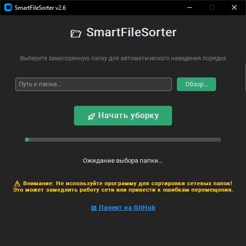

```markdown
# 📂 SmartFileSorter

**Умный сортировщик файлов с безопасным откатом и двуязычным интерфейсом**


---

## ✨ Возможности

- 🎯 **Умная категоризация** — автоматически определяет тип файла и перемещает в соответствующую папку
- 📅 **Сортировка по дате** — раскладывает фото и видео по папкам Год/Месяц (на русском!)
- 👁️ **Тестовый режим (Dry Run)** — анализирует файлы без реального перемещения
- 🛡️ **Безопасный откат** — создаёт BAT-скрипт для возврата всех файлов на места
- 📊 **Подробные логи** — ведёт отчёт о всех перемещениях и ошибках
- 🎨 **Современный интерфейс** — красивый UI на CustomTkinter с поддержкой тёмной/светлой темы
- 🖱️ **Drag & Drop** — перетаскивайте папки прямо в окно программы
- ⚡ **Многопоточность** — интерфейс остаётся отзывчивым во время работы
- 🔄 **Обработка дубликатов** — автоматически переименовывает файлы при конфликтах
- 📏 **Подсчёт размера** — показывает общий размер файлов перед сортировкой
- 🌐 **Двуязычный интерфейс** — переключение между русским и английским языками

## 📸 Скриншоты



## 🚀 Установка

### Требования

- Python 3.8 или выше
- Windows 10/11

### Быстрый старт (для пользователей)

Скачайте готовый `SmartFileSorter.exe` из релиза — установка Python не требуется!

### Запуск из исходного кода (для разработчиков)

**Шаг 1:** Клонирование репозитория

```bash
git clone https://github.com/kebineugene/SmartFileSorter.git
cd SmartFileSorter
```

**Шаг 2:** Установка зависимостей

```bash
pip install -r requirements.txt
```

**requirements.txt:**
```txt
customtkinter>=5.2.0
tkinterdnd2>=0.3.0
```

**Шаг 3:** Запуск

```bash
python main.py
```

## 📖 Использование

1. **Запустите приложение**
2. **Выберите язык** — переключатель в верхней части окна (🇷🇺 Русский / 🇬🇧 English)
3. **Выберите папку** — нажмите «Обзор...» или перетащите папку в поле ввода
4. **Настройте параметры:**
   - ☑️ **Тестовый режим** — сначала запустите, чтобы увидеть, что будет сделано
   - ☑️ **Сортировка по дате** — для фото и видео создаст структуру Год/Месяц
   - ☑️ **Открыть папку после** — автоматически откроет проводник после завершения
5. **Нажмите «🚀 Начать уборку»**
6. **Подтвердите операцию** (появится предупреждение)
7. **Дождитесь завершения** — прогресс-бар покажет статус
8. **Проверьте результаты** — откройте `sort_log.txt` для просмотра отчёта

### Категории файлов

| Категория | Расширения |
|-----------|-----------|
| 🖼️ **Изображения** | jpg, jpeg, png, gif, bmp, svg, webp, ico |
| 📄 **Документы** | pdf, docx, doc, txt, xlsx, xls, pptx, ppt, csv, rtf, odt |
| 📦 **Архивы** | zip, rar, 7z, tar, gz, bz2, xz |
| 🎵 **Музыка** | mp3, wav, flac, ogg, m4a, aac, wma |
| 🎬 **Видео** | mp4, avi, mkv, mov, wmv, flv, webm |
| 💿 **Программы** | exe, msi, bat, sh |
| 💽 **Образы дисков** | iso, img, bin |
| 🖥️ **Виртуализация** | vhd, vhdx, vmdk, qcow2, vdi, raw, ova, ovf |
| 📁 **Разное** | все остальные файлы |

### Откат изменений

Если нужно вернуть файлы на места:

1. Откройте папку, которую сортировали
2. Найдите файл `undo_sort.bat`
3. Запустите его двойным кликом
4. Все файлы вернутся в исходное состояние

## ⚠️ Важные предупреждения

- ❌ **Не используйте для сетевых папок** — может вызвать проблемы с подключением
- ❌ **Не сортируйте открытые файлы** — закройте все программы перед запуском
- ⚠️ **Telegram Downloads** — после сортировки старые файлы пропадут из чатов (но их можно вернуть через `undo_sort.bat`)
- 💾 **Делайте резервные копии** — перед первой сортировкой важных данных
- 🌐 **Язык интерфейса** — определяет названия создаваемых папок. Рекомендуется выбрать язык до начала сортировки

## 🏗️ Структура проекта

```
SmartFileSorter/
├── main.py              # GUI приложения (frontend)
├── organizer.py         # Логика сортировки файлов (backend)
├── i18n.py              # Модуль локализации (RU/EN)
├── icon.ico             # Иконка приложения
├── requirements.txt     # Зависимости Python
├── README.md           # Документация
└── SmartFileSorter.exe # Готовое приложение
```

## 🛠️ Стек технологий

- **Язык:** Python 3.8+
- **GUI:** CustomTkinter (современный Tkinter)
- **Drag & Drop:** TkinterDnD2
- **Локализация:** Собственный модуль i18n
- **Файловая логика:** pathlib, shutil, os
- **Многопоточность:** threading

## 🔧 Сборка приложения

Для создания .exe файла:

```bash
# Установите PyInstaller
pip install pyinstaller

# Соберите приложение
pyinstaller --noconfirm --onefile --windowed --name "SmartFileSorter" ^
    --add-data "i18n.py;." ^
    --add-data "organizer.py;." ^
    --hidden-import customtkinter ^
    --hidden-import tkinterdnd2 ^
    --collect-all customtkinter ^
    --collect-all tkinterdnd2 ^
    --icon=icon.ico ^
    main.py
```

Готовый файл появится в папке `dist/SmartFileSorter.exe`

## 📝 Roadmap

- [ ] Поддержка Linux и macOS
- [ ] Настраиваемые категории файлов
- [ ] Фильтры по размеру файлов
- [ ] Исключения для определённых папок/файлов
- [ ] Экспорт отчёта в CSV/JSON
- [ ] Интеграция с облачными хранилищами
- [ ] Автоматическое определение языка системы

## 🤝 Вклад в проект

Приветствуется! Если у вас есть идеи по улучшению:

1. Форкните репозиторий
2. Создайте ветку для новой функции (`git checkout -b feature/AmazingFeature`)
3. Закоммитьте изменения (`git commit -m 'Add some AmazingFeature'`)
4. Запушьте в ветку (`git push origin feature/AmazingFeature`)
5. Откройте Pull Request

## 📄 Лицензия

Проект распространяется под лицензией MIT.

## 🙏 Благодарности

- [CustomTkinter](https://github.com/TomSchimansky/CustomTkinter) — отличный UI фреймворк
- [TkinterDnD2](https://github.com/TkinterDnD/TkinterDnD2) — поддержка Drag & Drop

## 📬 Контакты

**Автор:** kebineugene  
**GitHub:** [@kebineugene](https://github.com/kebineugene)  
**Проект:** [SmartFileSorter](https://github.com/kebineugene/SmartFileSorter)

---

**⭐ Если проект был полезен, поставьте звезду на GitHub!**
```
